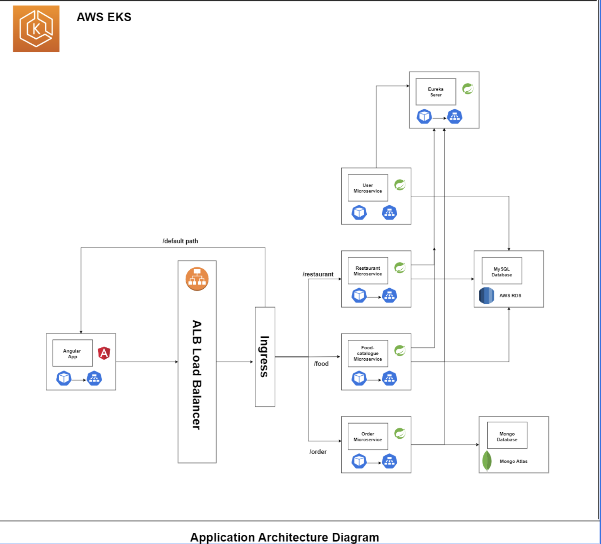
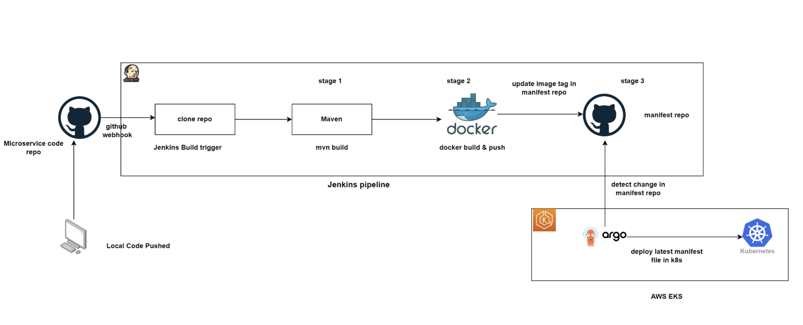

# FoodDeliveryApp_JFS_K8_ArgoCd

# Food Delivery Application 

A full-stack enterprice-grade food delivery application deployed on AWS EKS. This project utilizes **Spring Boot** for backend services, **Angular** for the frontend, and is containerised using **Docker** and orchestrated using **Kubernetes**.

## Architecture Diagrams

## Website Images

## Architecture Overview

The application is built using a microservices architecture with the following components:

### Backend (Spring Boot)
*   **Service Registry (Eureka):** Handles service discovery (Port `8761`).
*   **Restaurant Listing Service:** Manages restaurant data (Port `9091`, MySQL).
*   **Food Catalogue Service:** Manages food items and menus (Port `9092`, MySQL).
*   **User Information Service:** Handles user profiles and authentication (Port `9093`, MySQL).
*   **Order Service:** Manages order placement and processing (Port `9094`, MongoDB).

### Frontend (Angular)
*   **Food Delivery App:** A responsive web interface for users to browse restaurants and place orders.

## 🛠️ Tech Stack

### 🔙 Backend
*   **Language:** Java 17, Java 21
*   **Framework:** Spring Boot 3.5+
*   **Microservices:** Spring Cloud - Netflix Eureka, OpenFeign, Config
*   **Data Access:** Spring Data JPA - Hibernate, Spring Data MongoDB
*   **API Documentation:** SpringDoc OpenAPI - Swagger UI
*   **Utilities:** Lombok, MapStruct
*   **Build Tool:** Maven

### 🎨 Frontend
*   **Framework:** Angular 19
*   **Language:** TypeScript, JavaScript
*   **Styling:** CSS3, SCSS, FontAwesome Icons, Google Fonts
*   **State Management:** RxJS
*   **Rendering:** Angular SSR (Server-Side Rendering)
*   **Runtime:** Node.js

### 🗄️ Database
*   **Relational:** MySQL (AWS RDS)
*   **NoSQL:** MongoDB (MongoDB Atlas Cloud)

### ☁️ DevOps & Cloud Infrastructure
*   **Cloud Provider:** Amazon Web Services (AWS)
*   **Orchestration:** Kubernetes (AWS EKS - Elastic Kubernetes Service)
*   **Containerization:** Docker, Docker Hub
*   **Ingress:** AWS Application Load Balancer - ALB Controller
*   **GitOps:** ArgoCD
*   **Infrastructure as Code:** Eksctl, AWS CloudFormation
*   **IAM:** AWS IAM Roles & Policies

### ⚙️ Tools & IDEs
*   **IDEs:** IntelliJ IDEA, Visual Studio Code
*   **Version Control:** Git, GitHub
*   **API Testing:** Postman

